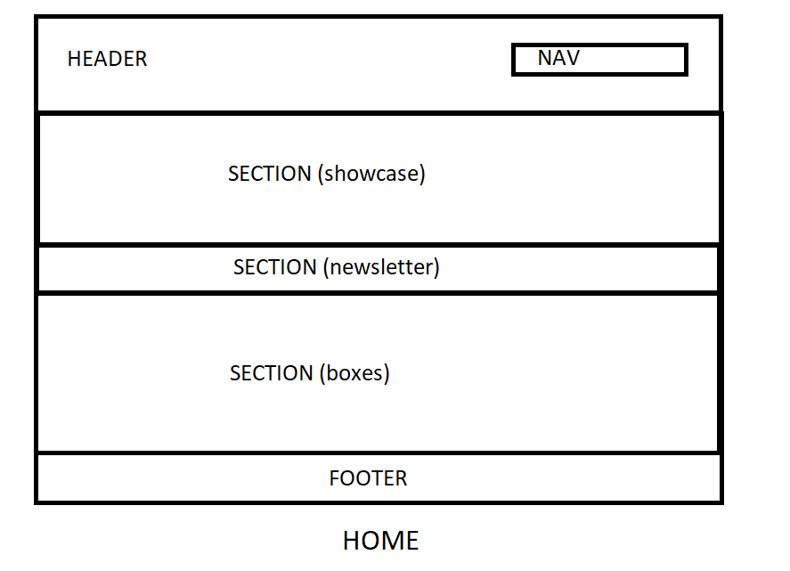
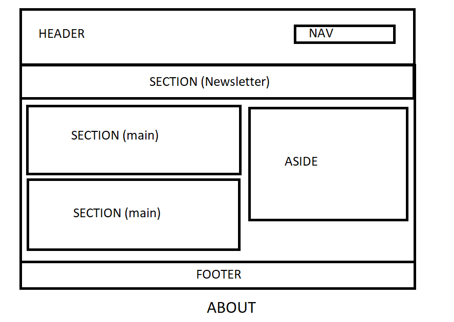
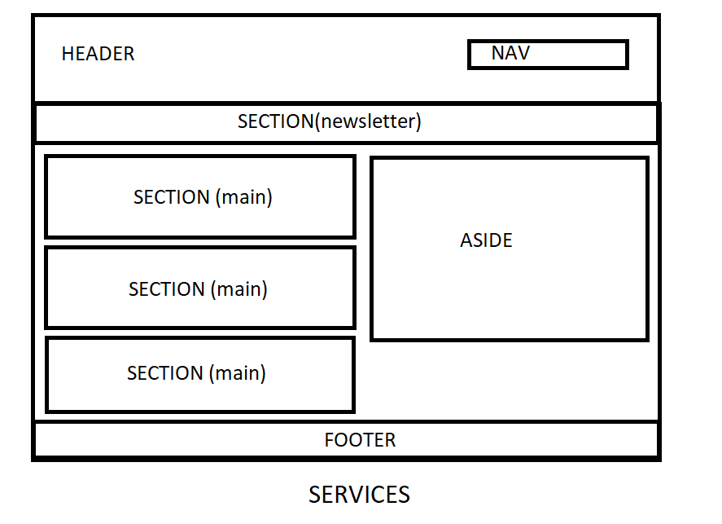

# Development Strategy

> `acme-web-design`

write a short description of your project:

- In this project I will work on acme-web-design tutorial by reverse engineering.

## Wireframe

### Home page

### About Menu

### Services Menu

## 0. Set-Up

__A User can see my initial repository and live demo__

### Repo

- Generated a new repository from this [template](https://github.com/HackYourFutureBelgium/w3-validation-template).
- Cloned the repository 
- Added wireframe
- Wrote a initial, basic README
- Wrote development strategy
- Turn on GitHub Pages

## 1. Header

> A user can see the structure and styles of header

### Repo

- This user story was developed on a branch called `header`
- It was merged to master when the feature was finished.

### HTML

- the title of the website and the names of inner pages

### CSS

- Create the 'style.css' into the css file and write global and header css features

## 2. Showcase

> A user can see the main content of the home page

### Repo

- This user story was developed on a branch called `showcase`

### HTML

- Create main content using _section_ tag
- Use 'container' class with 'div' tag to see a more tidy structure
- Add image

### CSS

- Set background as picture
- Adjust the gaps between the main content boxes using margin and padding
- Use 'float' feature for boxes to appear side by side

## 3. Footer

> A user can see the footer and copyright

### Repo

- This user story was developed on a branch called `footer`

### HTML

- Create a footer using footer tag

### CSS

- Create some basic css features like color, background, padding-margin etc. for footer

## 4. Inner Pages

> A user can see the header, main content and footer of the about and services menu pages

### Repo

- This user story was developed on a branch called `inner_pages`

### HTML

- Create html files named 'about' and 'services'

### CSS

- Adjust the gaps between the main content boxes using margin and padding
- Use 'float' feature for boxes to appear side by side

## Finishing Touches

- Wrote complete README
